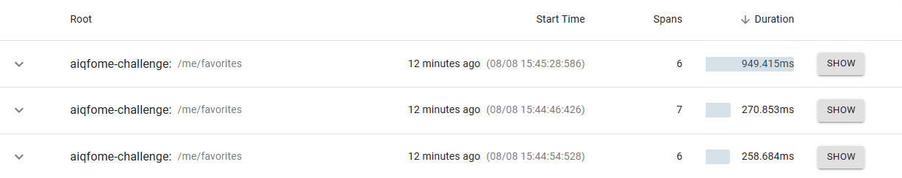
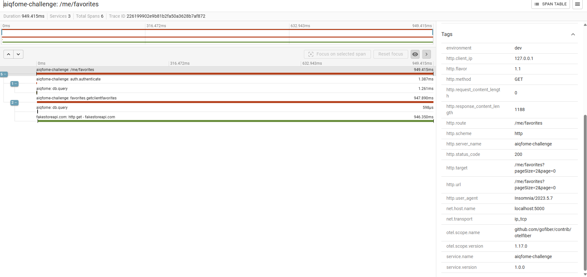

# Aiqfome - Backend challenge

Este repositório é para o desafio técnico da Magalu

## Stack

- **Go 1.25.5** or higher
- **Postgres**

## Instalando as Dependencias

### Makefile

O projeto possui um Makefile que tem alguns comandos úteis, você pode visualiza-los através do comando `make help`, vai exibir alguma tela mais ou menos assim

```bash
Usage:
  make [target]

Targets:
help                Display this help
tools/install       Install gofumpt, gocritic and swaggo
lint                Run golangci-lint
format              Format code
mocks/generate      Generate mock files
mocks/clean         Clean mock files
test                Run all tests
test/coverage       Run tests, make coverage report and display it into browser
test/coverage-browser  Open coverage report in browser
swagger             Generate swagger docs
run                 Run backend http server
clean               Remove cache files
migrate/up          Run database migrations up
migrate/down        Run database migrations down
```

### Ferramentas

O projeto tem algumas dependencias de desenvolvimento, são elas o gofumpt, gocritic, swaggo, mockery e o goose, você pode instalar elas facilmente através do comando `$ make tools/install`

### Migrations

Para o controle de migrations, utilizamos o Goose, para aplicara as migrations, também temos um comando no make, basta executar `make migrate/up` para aplicar as migrations

## Rodando a aplicação 🎲

Por fim, uma vez que temos todo o ambiente configurado, podemos executar a aplicação

```bash
# Se é primeira vez, crie um arquivo .env
# Você pode só copiar o exemplo e ajusta-lo
$ cp .env.example .env

# Inicie as dependencias
$ make dependencies/up

# Aplique as migrations
$ make migrate/up

# Inicie a aplicação, você pode acessar a docuemntação pelo swagger no endpoint http://localhost:${PORT}/docs/index.html
$ make run
```

## Testes

O projeto conta com testes unitários e de integração, você pode executa-los também através dos comandos make

```bash
# Executar todos os testes
$ make test

# Caso queira gerar o coverage
$ make test/coverage

# Caso queira gerar o coverage e abrir no navegador
$ make test/coverage-browser

# Caso você queira os testes com coverage, não precisa executar um comando por vez, basta executar a opção que você deseja e ele já faz tudo
# ou seja, caso você queira abrir o coverage no navegador, não precisa seguir a linha de make test -> make test/coverage -> make/test-coverage-browser, pode só executar o make/test-coverage-browser
```

## Escolhas tecnicas

Sobre a autenticação, implementei as roles de forma fixa, porém o ideal é salvar elas no banco de dados ou utilizar algum vendor externo como o Keycloack pra gerenciar a parte te autenticação/autorização

### Arquitetura

O projeto utiliza uma estrutura que é um mix de DDD com Clean arch, prezando isolar as regras de cada domínio em seu proprío pacote, então as regras exclusivamente referentes aos `favoritos` ficam no pacote `favoritos` e o que for Cross, fica dentro de internal/app.

### Autenticação

A autenticação é feita através de um token JWT, a aplicação recebe ela através do Header `Authorization` com o valor `Bearer {token}`, há um middleware que faz a validação deste token e permite (ou não) o acesso as rotas protegidas.
Também há uma camada de cache para evitar chamadas repetidas para valdiar se o cliente existe no banco

### Autorização

Como não tinha muito tempo, optei por implementar uma forma simples de autorização através de roles fixas, mas isso pode (e deve!) ser facilmente substituido por uma solução mais robusta, seja gerenciando as roles através de um banco ou usando uma solução como o Keycloack.

### Tratamento de erros

Para controlar melhor os erros, criei o pacote `pkg/domainerror`, ele centraliza a lógica de tratamento de erros da minha aplicação, me permitindo adicionar o contexto de onde aconteceu o erro e trabalhar com códigos de erro, dessa forma fica mais fácil rastrear a origem dos problemas e facilita a comunicação com outras API's

### Validação

Optei por implementar uma validação manual, mais para demonstrar mais controle, porém uma ótima opção é utilizar o go-playground/validator que já conta com uma série de validações mais automatizadas, o contra é que as mensagens não são muito legíveis, é possível configura-las, porém adiciona uma camada de complexidade desnecessária, quando é algo mais simples, gosto de seguir com essa abordagem.

### Observabilidade

Para observabilidade, implementei uma solução com o [opentelemetry](https://opentelemetry.io/), dessa forma é só trocar o adapter e tudo irá funcionar normalmente.

#### Traces



#### Spans



## Pontos de melhoria

Devido ao tempo curto, acabei deixando de fora algumas coisas que são de extrema importancia para API's com alta performance

- Métricas
Um ponto muito importante para garantir a saude da aplicação são as métricas, é importante ter métricas de saude (uso de memória, CPU, I/O) e também métricas de negócio (error rate, hit/miss nas operações do banco, métricas indicando o sucesso/falha de aplicações de regras de negócio)

- Testes E2E
Outro ponto muito importante é a necessidade de configurar uma esteira de testes E2E de pelo menos os fluxos mais críticos da aplicação

- Invalidar tokens
Manter um controle dos tokens do usuário e ter a opção de invalidar um token
